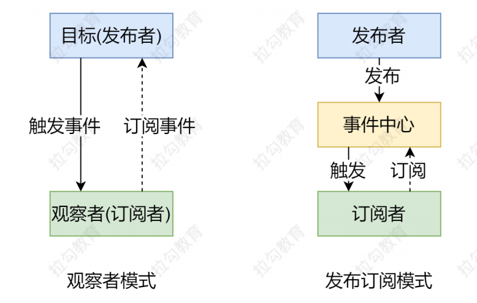
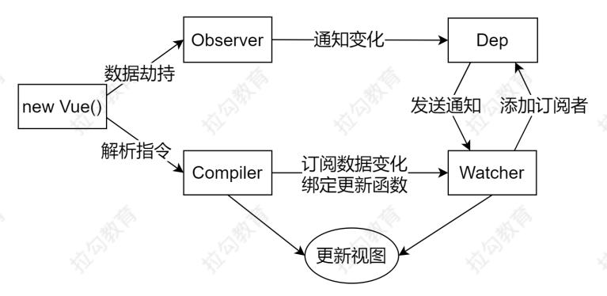

## 发布订阅模式和观察者模式

- **观察者模式**是由具体目标调度，比如当事件触发，Dep 就会去调用观察者的方法，所以观察者模
式的订阅者与发布者之间是存在依赖的。
- **发布/订阅模式**由统一调度中心调用，因此发布者和订阅者不需要知道对方的存在。

## Vue原理
- Vue
    - 把 data 中的成员注入到 Vue 实例，并且把 data 中的成员转成 getter/setter
- Observer
    - 能够对数据对象的所有属性进行监听，如有变动可拿到最新值并通知 Dep
- Compiler
    - 解析每个元素中的指令/插值表达式，并替换成相应的数据
- Dep
    - 添加观察者(watcher)，当数据变化通知所有观察者
- Watcher
    - 数据变化更新视图

    