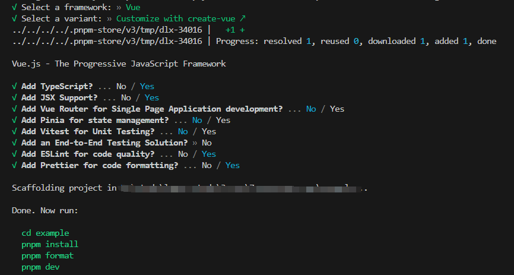
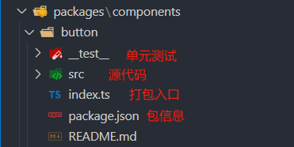
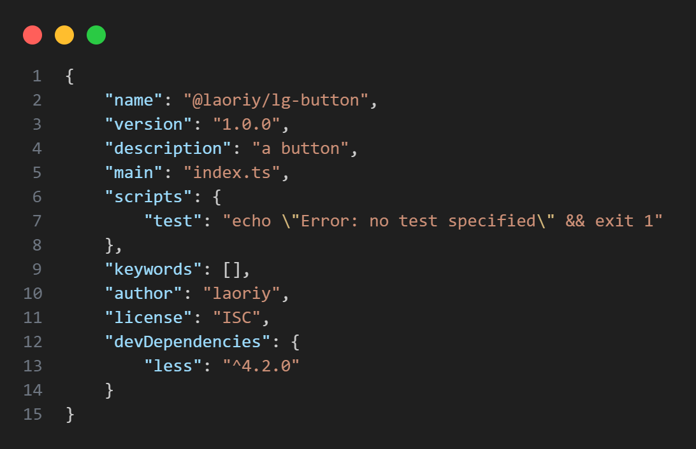
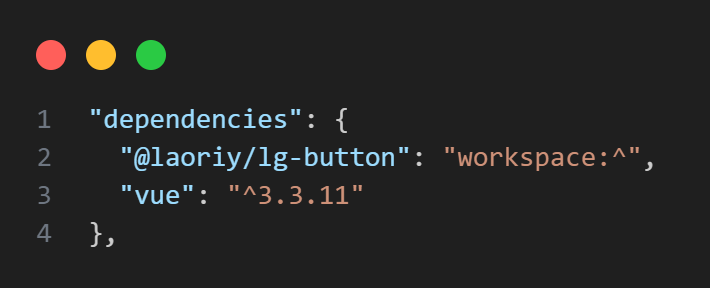

# 一文学会 pnpm monorepo + vite + ts 搭建自己的 vue3 组件库

## 为什么用 pnpm?

[pnpm](https://pnpm.io/zh/ "pnpm") 是 快速的，节省磁盘空间的包管理工具。诸如 vue3 、element-plus 都在使用它

其主要优点如下：

-   节省磁盘空间：pnpm 使用共享依赖项的方式，可以避免在每个项目中重复安装相同的依赖项，从而显著减少项目所占用的磁盘空间。

-   加快安装速度：由于共享依赖项，pnpm 在安装过程中只需要下载和解压一次依赖项，然后将它们链接到各个项目中，从而大大减少了安装时间。
-   高效的本地缓存：pnpm 使用本地缓存来存储已经下载的依赖项，这意味着相同的依赖项在不同项目之间可以被重用，减少了网络传输和下载时间。

-   支持 monorepo: pnpm 内置了对存储库中的多个包的支持;

## 环境搭建

### 安装 pnpm

推荐 node 版本 > v16.0.0，本文使用 v18.18.0

```shell
npm install -g pnpm
```

新建目录，例如 monorepo-cmp

```shell
mkdir monorepo-cmp
cd monorepo-cmp
```

### 初始化环境

```shell
pnpm init
```

此时会生成 package.json 文件，根据自身需要进行修改。

```json
{
    "private": true,
    "name": "@laoriy/vue3-ui",
    "description": "",
    "main": "index.js",
    "scripts": {
        "test": "echo \"Error: no test specified\" && exit 1"
    },
    "keywords": [],
    "author": "",
    "license": "ISC"
}
```

### 创建 workspace

pnpm 内置了对单一存储库（也称为多包存储库、多项目存储库或单体存储库）的支持，只需要创建[workspace](https://pnpm.io/workspaces "workspace")即可。

根目录创建`packages`文件夹，以此作为组件库，工具库等工作空间

再新建 `pnpm-workspace.yaml` 文件，用来声明对应的工作区。

`example`文件夹 会作为示例项目，用来开发和测试组件

```yaml
packages:
    # 存放组件库和其他工具库
    - "packages/**"
    # 存放组件测试的代码
    - "example"
```

### 创建组件测试环境

在根目录执行

```shell
pnpm create vite example
```



然后在根目录下面的`package.json`下面添加`scripts`脚本。`pnpm -C <path>, --dir <path>`在 `<path>` 中启动 pnpm ，而不是当前的工作目录。

```json
 "scripts": {
    "dev": "pnpm -C example dev"
  }
```

在根目录执行 `pnpm dev` 启动测试服务

接着在 `packages` 目录下，创建`components`文件夹

## 编写组件

实际业务场景中，我们更需要的是业务组件

个人觉得独立发布更好维护，每个组件都是一个独立的npm包，可参考vue的monorepo

当然选择一个包含有所有组件也没问题，可参考element-plus的monorepo

### 创建一个Button组件

在`components`文件夹下创建`button`文件夹



package.json



编写button组件

```vue
<template>
    <button class="button" :class="typeClass">
        <slot></slot>
    </button>
</template>

<script setup>
import { computed } from "vue"

defineOptions({
    name: "lGButton",
})
const props = defineProps({
    type: {
        type: String,
        default: "default",
    },
})
const typeClass = computed(() => `button-${props.type}`)
</script>

<style lang="less" scoped>
.button {
    border-radius: 4px;
    padding: 8px 16px;
    font-size: 16px;
    cursor: pointer;

    &-default {
        background-color: #eee;
        color: #333;
    }

    &-primary {
        background-color: #007bff;
        color: #fff;
    }
}
</style>
```

由于用到了less，需要在该目录下安装一下`pnpm add less -D`

### withInstall方法

为了支持全局引入，增加一个withInstall方法。

在utils/src/with-install.ts文件，代码如下：

```ts
/** 以下代码参考element-plus */
import type { App, Plugin } from "vue"

type SFCWithInstall<T> = T & Plugin

export const withInstall = <T, E extends Record<string, any>>(
    main: T,
    extra?: E
) => {
    ;(main as SFCWithInstall<T>).install = (app: App): void => {
        for (const comp of [main, ...Object.values(extra ?? {})]) {
            app.component(comp.name, comp)
        }
    }

    if (extra) {
        for (const [key, comp] of Object.entries(extra)) {
            ;(main as any)[key] = comp
        }
    }
    return main as SFCWithInstall<T> & E
}
```

在utils/index.ts中添加

```ts
export * from "./src/with-install"
```

生成utils 包的package.json如下：

```json
{
    "name": "@laoriy/lg-utils",
    "main": "index.ts",
    "private": true,
    "license": "ISC"
}
```

全局安装pnpm add @laoriy/lg-utils -w

修改index.ts中导出组件

```ts
import _Button from "./src/index.vue"
import { withInstall } from "@laoriy/lg-utils"

export default withInstall(_Button)
```

### 引入组件

然后在example根目录执行

```shell
pnpm add @laoriy/lg-button
```

可以看到package.json 已经添加了依赖，由于pnpm是由workspace管理，前缀workspace可以指向components下的工作空间从而方便本地直接调试各个包。


此时我们就可以在页面中使用了

-   全局引入：
    ```ts
    // example/src/main.ts
    import lGButton from "@laoriy/lg-button"
    app.use(lGButton)
    ```
-   按需引入

        ```vue
        <script setup lang="ts">
        // example/src/App.vue
        import lGButton from "@laoriy/lg-button"
        </script>

        <template>
            <div>
                <lGButton type="primary">test lGButton</lGButton>
            </div>
        </template>
        ```

按钮已经正常显示，说明我们的引入是成功的
