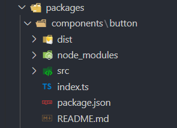
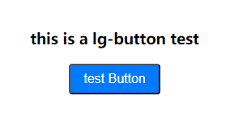

# 一文学会 pnpm monorepo + vite + ts 搭建自己的 vue3 组件库

## 为什么用 pnpm?

[pnpm](https://pnpm.io/zh/ "pnpm") 是 快速的，节省磁盘空间的包管理工具。诸如 vue3 、element-plus 都在使用它

其主要优点如下：

-   节省磁盘空间：pnpm 使用共享依赖项的方式，可以避免在每个项目中重复安装相同的依赖项，从而显著减少项目所占用的磁盘空间。

-   加快安装速度：由于共享依赖项，pnpm 在安装过程中只需要下载和解压一次依赖项，然后将它们链接到各个项目中，从而大大减少了安装时间。
-   高效的本地缓存：pnpm 使用本地缓存来存储已经下载的依赖项，这意味着相同的依赖项在不同项目之间可以被重用，减少了网络传输和下载时间。

-   支持 monorepo: pnpm 内置了对存储库中的多个包的支持;

## 环境搭建

### 安装 pnpm

推荐 node 版本 > v16.0.0，本文使用 v18.18.0

```shell
npm install -g pnpm
```

新建目录，例如 monorepo-cmp

```shell
mkdir monorepo-cmp
cd monorepo-cmp
```

### 初始化环境

```shell
pnpm init
```

此时会生成 package.json 文件

根目录不用当作包发布，在package.json加入如下设置：

```json
{
    "private": true
}
```

### 创建 workspace

pnpm 内置了对单一存储库（也称为多包存储库、多项目存储库或单体存储库）的支持，只需要创建[workspace](https://pnpm.io/workspaces "workspace")即可。

根目录创建`packages`文件夹，以此作为组件库，工具库等工作空间

再新建 `pnpm-workspace.yaml` 文件，用来声明对应的工作区。

`example`文件夹 会作为示例项目，用来开发和测试组件

```yaml
packages:
    # 存放组件库和其他工具库
    - "packages/**"
    # 构建工具相关
    - "internal/**"
    # 存放组件测试的代码
    - "example"
```

### 创建组件测试环境

在根目录执行

```shell
pnpm create vite example
```


然后在根目录下面的`package.json`下面添加`scripts`脚本。`pnpm -C <path>, --dir <path>`在 `<path>` 中启动 pnpm ，而不是当前的工作目录。

```json
 "scripts": {
    "dev": "pnpm -C example dev"
  }
```

在根目录执行 `pnpm dev` 启动测试服务

## 编写组件

实际业务场景中，我们更需要的是业务组件

个人觉得独立发布更好维护，每个组件都是一个独立的npm包，可参考vue的monorepo

当然选择一个包含有所有组件也没问题，可参考element-plus的monorepo

在 `packages` 目录下，创建`components`文件夹

### 创建一个Button组件

在`components`文件夹下创建`button`文件夹



package.json

```json
{
    "name": "@laoriy/lg-button",
    "version": "1.0.0",
    "description": "a button",
    "main": "index.ts",
    "scripts": {},
    "license": "ISC"
}
```

编写button组件

```vue
<template>
    <button class="button" :class="typeClass">
        <slot></slot>
    </button>
</template>

<script setup>
import { computed } from "vue"

defineOptions({
    name: "lGButton",
})
const props = defineProps({
    type: {
        type: String,
        default: "default",
    },
})
const typeClass = computed(() => `button-${props.type}`)
</script>

<style lang="less" scoped>
.button {
    border-radius: 4px;
    padding: 8px 16px;
    font-size: 16px;
    cursor: pointer;

    &-default {
        background-color: #eee;
        color: #333;
    }

    &-primary {
        background-color: #007bff;
        color: #fff;
    }
}
</style>
```

由于用到了less，需要安装一下 `pnpm add less -D`

### withInstall方法

为了支持最终该组件可以被全局引入，增加一个withInstall方法。

生成utils 包的package.json如下：

```json
{
    "private": true,
    "name": "@laoriy/lg-utils",
    "main": "index.ts",
    "license": "ISC"
}
```

utils/index.ts作为入口

```ts
export * from "./src/with-install"
```

创建utils/src/with-install.ts文件，代码如下：

```ts
/** 以下代码参考element-plus */
import type { App, Plugin } from "vue"

type SFCWithInstall<T> = T & Plugin

export const withInstall = <T, E extends Record<string, any>>(
    main: T,
    extra?: E
) => {
    ;(main as SFCWithInstall<T>).install = (app: App): void => {
        for (const comp of [main, ...Object.values(extra ?? {})]) {
            app.component(comp.name, comp)
        }
    }

    if (extra) {
        for (const [key, comp] of Object.entries(extra)) {
            ;(main as any)[key] = comp
        }
    }
    return main as SFCWithInstall<T> & E
}
```

@laoriy/lg-utils这个包就创建好了

由于这个包我不想发布到npm，如果要在其它包使用，需要全局安装 `pnpm add @laoriy/lg-utils -w -D`

-w或--workspace代表允许安装到根目录下、全局所以项目都直接可以使用

然后修改Button组件的入口index.ts，如下：

```ts
import _Button from "./src/index.vue"
import { withInstall } from "@laoriy/lg-utils"

export default withInstall(_Button)
```

### 引入组件

在example目录下执行 `pnpm add @laoriy/lg-button`

可以看到package.json 已经添加了依赖，由于pnpm是由workspace管理，前缀workspace可以指向components下的工作空间从而方便本地直接调试各个包。

```json
"dependencies": {
    "@laoriy/lg-button": "workspace:^",
    "vue": "^3.3.11"
}
```

此时我们就可以在example项目中的页面中使用了：

-   全局引入：
    ```ts
    // example/src/main.ts
    import lGButton from "@laoriy/lg-button"
    app.use(lGButton)
    ```
-   按需引入

    ```vue
    <script setup lang="ts">
    // example/src/App.vue
    import lGButton from "@laoriy/lg-button"
    </script>

    <template>
        <div class="test-button">
            <h3>this is a lg-button test</h3>
            <lGButton type="primary">test Button</lGButton>
        </div>
    </template>
    ```

按钮已经正常显示，说明我们的引入是成功的



## 配置打包

### 封装打包逻辑

在internal/build目录下创建 `@laoriy/lg-build` 包

我们可以对vite打包的一些配置进行简单封装，由于这里只是演示，大部分内容都是写死。

```ts
// build/src/build.ts
import { UserConfig, PluginOption } from "vite"
import copy from "rollup-plugin-copy"

// https://vitejs.dev/config/
function createViteConfig({
    plugins = [],
}: {
    plugins?: PluginOption[]
}): UserConfig {
    return {
        plugins: [
            ...plugins,
            copy({
                targets: [{ src: ["package.json", "README.md"], dest: "dist" }],
            }) as PluginOption,
        ],
        build: {
            target: "es2015",
            //打包文件目录
            outDir: "dist",
            //压缩
            minify: true,
            rollupOptions: {
                //忽略打包vue
                external: ["vue"],
                output: [
                    {
                        format: "es",
                        // 打包成.mjs
                        entryFileNames: "[name].mjs",
                        dir: "dist/es",
                    },
                    {
                        format: "umd",
                        entryFileNames: "[name].js",
                        name: "lGButton",
                        dir: "dist/umd",
                        globals: {
                            vue: "Vue",
                        },
                    },
                ],
            },
            lib: {
                entry: "./index.ts",
                name: "lGButton",
            },
        },
    }
}

export { createViteConfig }

// build/src/index.ts
export * from "./build"
```

然后通过 `unbuild` 对该包进行构建

为什么要使用构建后的文件？

Button组件使用vite进行打包，构建过程中对于引入的第三方包，此处就会对该包进行判断是否是ESM，但我们的项目使用了ts，vite无法识别该扩展名，会报错。

```ts
// build/build.config.ts
import { defineBuildConfig } from "unbuild"

export default defineBuildConfig({
    entries: ["src/index"],
    clean: true,
    declaration: true,
    rollup: {
        emitCJS: true,
    },
})
```

package.json:

```json
{
    "name": "@laoriy/lg-build",
    "version": "1.0.0",
    "private": true,
    "description": "",
    "main": "./dist/index.cjs",
    "module": "./dist/index.mjs",
    "types": "./dist/index.d.ts",
    "scripts": {
        "stub": "unbuild --stub",
        "dev": "pnpm run stub",
        "build": "unbuild"
    },
    "keywords": [],
    "author": "",
    "license": "ISC",
    "devDependencies": {
        "rollup-plugin-copy": "^3.5.0",
        "unbuild": "^2.0.0"
    }
}
```

在build目录运行 `pnpm run build`打包构建，然后就可以使用该包了。

### 组件打包

在 components/button 目录下

运行 `pnpm add vite rimraf -w -D`，全局安装

运行 `pnpm add @vitejs/plugin-vue -D`，本项目安装

增加 ``vite.config.ts`,代码如下：

```ts
// components/button/vite.config.ts
import { defineConfig } from "vite"
import vue from "@vitejs/plugin-vue"
import { createViteConfig } from "@laoriy/lg-build"

export default defineConfig(createViteConfig({ plugins: [vue()] }))
```

修改package.json

```json
"script":{
    "clean:dist": "rimraf ./dist",
    "build": "pnpm clean:dist && vite build",
}
```

然后运行 `pnpm run build` 打包组件，生成 dist 文件夹

## 发布

细心的同学可能已经发现了，button包的package.json 的main字段值为 index.ts，直接拿去发布是不对的。

这里我们可以借助于pnpm提供的 [publishConfig](https://pnpm.io/zh/package_json#publishconfig "publishConfig") 配置进行简单配置即可：

```json
"publishConfig": {
    "main": "./umd/index.js",
    "module": "./es/index.mjs"
},
```

然后重新打包，并对最终打包生成的dist目录，直接执行pnpm publish 即可。

可以在button目录下的package.json添加命令：

```json
"script":{
    "pub": "cd ./dist && pnpm publish"
}
```

至此发布完成。

## TypeScript
